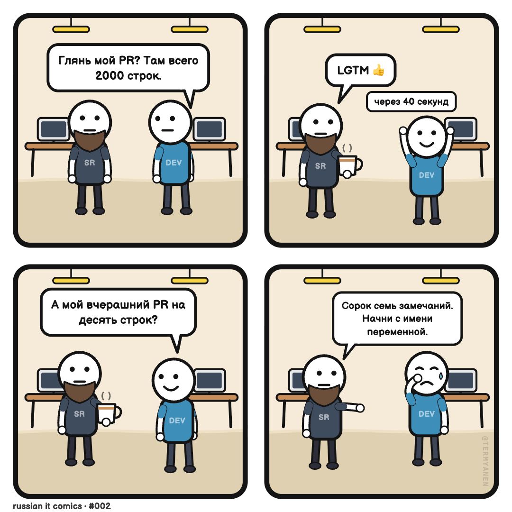

# 💥 Comic Builder

**Make 4-panel dev comics without drawing skills.** Runs in the browser, free, no backend.

🇷🇺 [Русская версия](README.ru.md) · **[Try it live →](https://termyanen.github.io/comic-builder/)**



## What's inside

- **12 characters** — dev, AI robot, senior, PM, boss, QA, designer, devops, intern, client, HR and a cat. 9 poses, 8 moods, gaze direction, quarter body turn, items held in hands, per-series custom outfits.
- **Comic language** — speech bubbles with voices (shout, thought, whisper, robo), a terminal window with command chips, yellow approval buttons, big BAM! lettering, comic effects (impact, sweat, zzz, focus lines).
- **Script → strip** — type a plain-text script (`hero angry: line`) and the strip assembles itself. Works in English and Russian.
- **Direct manipulation** — drag characters, bubbles, bubble tails, effects and captions right in the panel. Undo/redo, arrow-key nudging, panel copy/swap, scene templates (built-in + your own).
- **Platform-ready export** — 1080×1080 square (Instagram/Threads), vertical 1×4 strip (Telegram), per-panel carousel — or all of them with one click. Fonts are embedded into the export, strips save/load as JSON.
- **No backend** — everything lives in your browser's localStorage.

## Quick start

```bash
npm install
npm run dev
```

Node 22+. Production build: `npm run build` (static files in `dist/`).

## Text script format

```
title: Standup
episode: #002

panel 1
bg: office, theme sand
hero happy typing: Done, the feature is ready!
robot: Check before deploy?

panel 2
terminal: Checking... | Problems found: 0 | $ ship-it
```

Each panel starts with `panel N`. A speech line is `who [mood] [pose]: text` — the first mentioned character stands on the right, the second on the left, tails point at the speaker automatically. Special lines: `bg`, `theme`, `caption`, `fx`, `terminal` (rows split by `|`), `button`.

## Architecture notes

- React + TypeScript + Vite + Zustand, rendering is pure SVG (no canvas).
- A character is data, not an image: poses are limb paths, emotions are a face layer, outfits are colors. A new character is a ~10-line file registered in `src/svg/characters/`.
- PNG export serializes the SVG with the webfont embedded as base64 — otherwise the rasterizer silently falls back to a system font.

## Credits

The visual language is inspired by the classic minimalist web-comic tradition. Font: [Balsamiq Sans](https://fonts.google.com/specimen/Balsamiq+Sans) (OFL).

## License

MIT — see [LICENSE](LICENSE).
